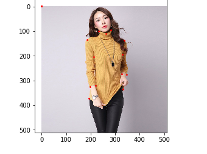
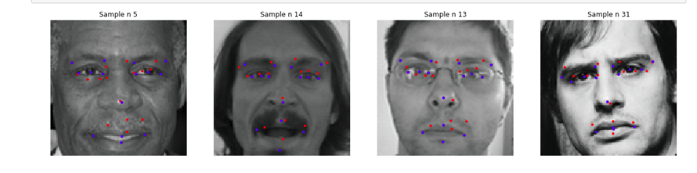
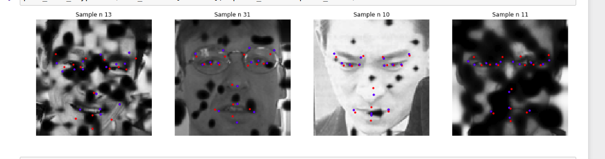
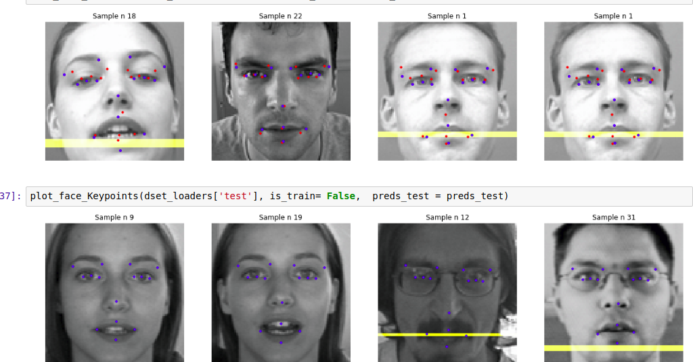

# Hdu_DeepLearning
记录自己在创新实践课程的学习


> * 阿里天池2018广东工业智造图像比赛
> * 阿里天池2018 Keypoints Detection of Apparel-Challenge the Baseline
> * 人脸关键节点检测
> * LFW人脸库处理以及人脸识别


## 阿里天池2018广东工业智造图像比赛

学习使用2018年最新的group normalization来处理图像瑕疵检测

将大赛给的四百多张铝型材图片，根据所损坏的程度分成12类。确定为图形分类问题。

| 瑕疵名        | 提交结果   |  
| --------   | -----:  | 
| 正常     | norm |  
| 不导电        |   defect1   |  
| 擦花        |    defect2    |  
| 横条压凹        |    defect3    | 
| 桔皮        |    defect4    | 
| 漏底        |    defect5    | 
| 碰伤        |    defect6    | 
| 起坑        |    defect7    | 
| 凸粉        |    defect8    | 
| 涂层开裂        |    defect9    | 
| 脏点        |    defect10    | 
| 其他        |    defect11    | 


```python
label_warp = {'正常': 0,
              '不导电': 1,
              '擦花': 2,
              '横条压凹': 3,
              '桔皮': 4,
              '漏底': 5,
              '碰伤': 6,
              '起坑': 7,
              '凸粉': 8,
              '涂层开裂': 9,
              '脏点': 10,
              '其他': 11,
              }

```

具体的处理方法看仓库
[仓库地址](https://github.com/Qinxianshen/tianchi_2018_guangdong_image)

最终成绩：（668/2972）

## 阿里天池2018 Keypoints Detection of Apparel-Challenge the Baseline

> * 数据预处理
> * 训练模型
> * 用模型去预测新的点的位置



详细内容见相关仓库：
[衣服关键节点检测](https://github.com/Qinxianshen/MobileNet_facekeypoint)


## 人脸关键节点检测

> * 人脸定位
> * 数据加载处理
> * MobileNet网络编写
> * 训练与测试

没用数据增强：



使用数据增强：





红色的点是预测的值，蓝色的点是实际的值


详细内容见相关仓库：
[人脸关键节点检测](https://github.com/Qinxianshen/MobileNet_facekeypoint)


## LFW人脸库处理以及人脸识别

> * Group Normaliztion
> * 卷积原理
> * MobileNet
> * 使用VGG19+Group Normaliztion 在LFW上分类

详细内容见相关仓库：
[LFW人脸库处理](https://github.com/Qinxianshen/lfw-face)

[人脸识别](https://github.com/Qinxianshen/Face_-classification_)


## 关于我

Github:https://github.com/Qinxianshen

CSDN: https://blog.csdn.net/Qin_xian_shen

个人博客: http://saijiadexiaoqin.cn/

Gitchat:https://gitbook.cn/gitchat/author/59ef0b02a276fd1a69094634

哔哩哔哩：https://space.bilibili.com/126021651/#/

微信公众号：松爱家的小秦

更多LIVE：

[如何利用 Selenium 爬取评论数据？](https://gitbook.cn/gitchat/activity/59ef0fbf54011222e227c720)

[Neo4j 图数据库在社交网络等领域的应用](https://gitbook.cn/gitchat/activity/5a310961259a166307ceadb4)

[如何快速编写小程序商城和安卓 APP 商城](https://gitbook.cn/gitchat/activity/5b628776ff984e633d987f7d)


